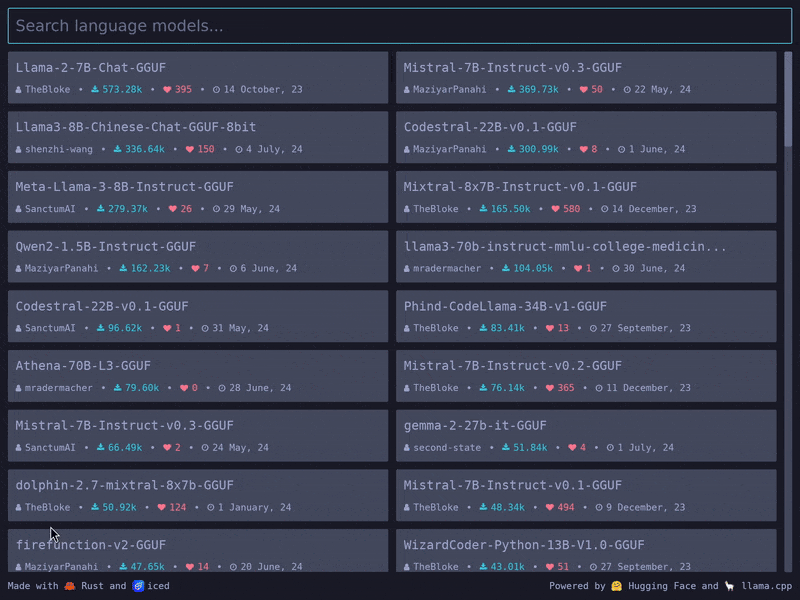

<div align="center">

# Icebreaker

[](https://crates.io/crates/icebreaker)
[](https://github.com/hecrj/icebreaker/blob/master/LICENSE)
[](https://crates.io/crates/icebreaker)
[](https://github.com/hecrj/icebreaker/actions)
[](https://github.com/iced-rs/iced)

A local AI chat app powered by 🦀 Rust, 🧊 iced, 🤗 Hugging Face, and 🦙 llama.cpp



</div>

## Installation

No pre-built binaries yet! Use `cargo` to try it out:

```bash
cargo install --git https://github.com/hecrj/icebreaker.git
```

You also need either [`llama.cpp@66ee4f2`] or [Docker] installed, for now.

[`llama.cpp@66ee4f2`]: https://github.com/ggerganov/llama.cpp/tree/66ee4f297cff3c7ce98b31dbc0ce909d41b9e40
[Docker]: https://www.docker.com/


## Why "Icebreaker"?

[Blame Mistral!](assets/naming.png)
